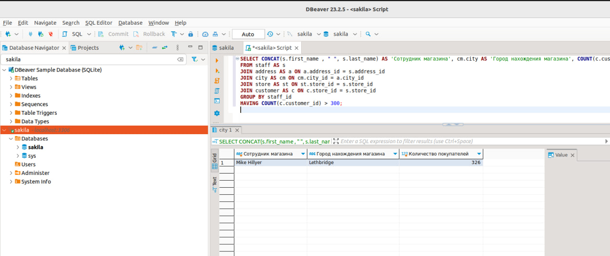
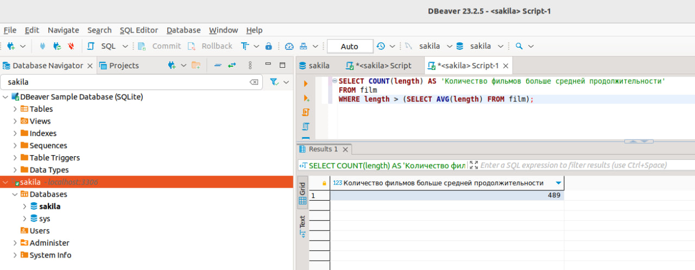
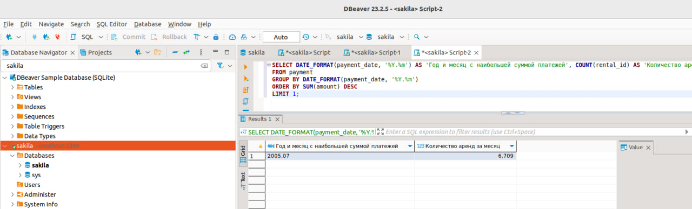
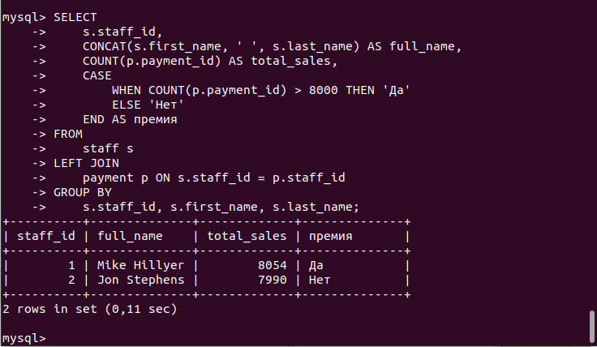
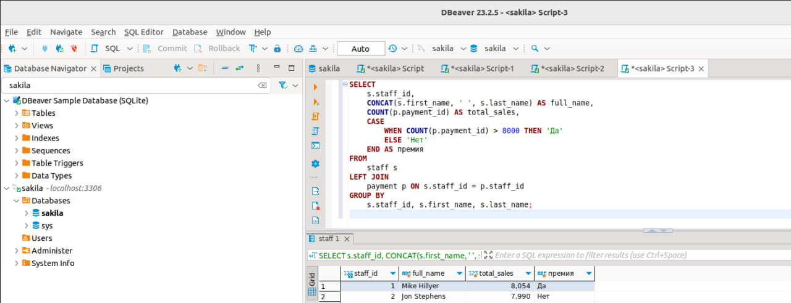
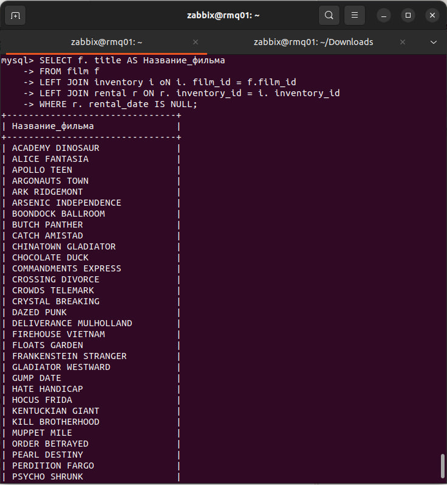
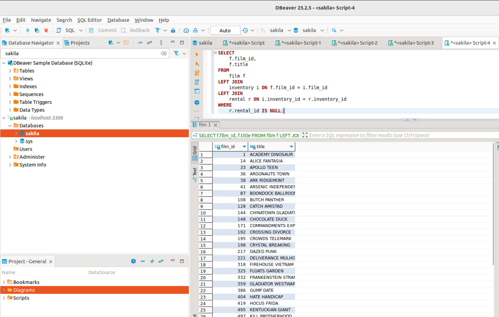

# 12.4 SQL. Часть 2 - Хомяков Антон

Задание можно выполнить как в любом IDE, так и в командной строке.

### Задание 1

Одним запросом получите информацию о магазине, в котором обслуживается более 300 покупателей, и выведите в результат следующую информацию: 
- фамилия и имя сотрудника из этого магазина;
- город нахождения магазина;
- количество пользователей, закреплённых в этом магазине.

#### *Решение:*
```sql
SELECT CONCAT(s.first_name , " ", s.last_name) AS 'Сотрудник магазина', cm.city AS 'Город нахождения магазина', COUNT(c.customer_id) AS 'Количество покупателей'
FROM staff AS s
JOIN address AS a ON a.address_id = s.address_id
JOIN city AS cm ON cm.city_id = a.city_id
JOIN store AS st ON st.store_id = s.store_id
JOIN customer AS c ON c.store_id = s.store_id
GROUP BY staff_id
HAVING COUNT(c.customer_id) > 300;
```
Cкриншот запроса:


### Задание 2

Получите количество фильмов, продолжительность которых больше средней продолжительности всех фильмов.

#### *Решение:*
```sql
SELECT COUNT(length) AS 'Количество фильмов больше средней продолжительности'
FROM film
WHERE length > (SELECT AVG(length) FROM film);
```
Cкриншот запроса:


### Задание 3

Получите информацию, за какой месяц была получена наибольшая сумма платежей, и добавьте информацию по количеству аренд за этот месяц.

#### *Решение:*
```sql
SELECT DATE_FORMAT(payment_date, '%Y.%m') AS 'Год и месяц c наибольшей суммой платежей', COUNT(rental_id) AS 'Количество аренд за месяц'
FROM payment
GROUP BY DATE_FORMAT(payment_date, '%Y.%m')
ORDER BY SUM(amount) DESC
LIMIT 1;
```
Cкриншот запроса:


---

## Дополнительные задания (со звёздочкой*)
Эти задания дополнительные, то есть не обязательные к выполнению, и никак не повлияют на получение вами зачёта по этому домашнему заданию. Вы можете их выполнить, если хотите глубже шире разобраться в материале.

### Задание 4*

Посчитайте количество продаж, выполненных каждым продавцом. Добавьте вычисляемую колонку «Премия». Если количество продаж превышает 8000, то значение в колонке будет «Да», иначе должно быть значение «Нет».

### Решение 4
```sql
SELECT 
    s.staff_id,
    CONCAT(s.first_name, ' ', s.last_name) AS full_name,
    COUNT(p.payment_id) AS total_sales,
    CASE 
        WHEN COUNT(p.payment_id) > 8000 THEN 'Да'
        ELSE 'Нет'
    END AS премия
FROM 
    staff s
LEFT JOIN 
    payment p ON s.staff_id = p.staff_id
GROUP BY 
    s.staff_id, s.first_name, s.last_name;
```
Cкриншот запроса:


---
### Задание 5*

Найдите фильмы, которые ни разу не брали в аренду.

### Решение 5
```sql
SELECT 
    f.film_id,
    f.title
FROM 
    film f
LEFT JOIN 
    inventory i ON f.film_id = i.film_id
LEFT JOIN 
    rental r ON i.inventory_id = r.inventory_id
WHERE 
    r.rental_id IS NULL;

```
Cкриншот запроса:


---

